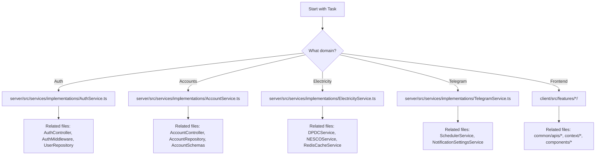

# AI Agent Guidelines

This document defines how AI agents should operate within the Bill Barta codebase.

## Allowed Tasks

AI agents are authorized to perform the following tasks:

### Code Tasks

| Task                         | Scope    | Guidelines                                           |
| ---------------------------- | -------- | ---------------------------------------------------- |
| **Bug Fixes**                | All code | Follow existing patterns, include error handling     |
| **New Features**             | All code | Follow layered architecture, create proper structure |
| **Refactoring**              | All code | Maintain functionality, update tests                 |
| **Code Review**              | All code | Check against rules in `ai/RULES.md`                 |
| **Performance Optimization** | All code | Measure before/after, document changes               |
| **Security Improvements**    | All code | Follow security rules, never weaken security         |

### Documentation Tasks

| Task                       | Scope                        | Guidelines                  |
| -------------------------- | ---------------------------- | --------------------------- |
| **Generate Documentation** | `docs/`, `ai/`, README files | Match existing style        |
| **Update API Docs**        | `docs/API_REFERENCE.md`      | Keep synchronized with code |
| **Add Code Comments**      | Source files                 | JSDoc for public APIs       |
| **Architecture Diagrams**  | `docs/ARCHITECTURE.md`       | Mermaid or ASCII art        |

### Analysis Tasks

| Task                     | Scope                   | Output                      |
| ------------------------ | ----------------------- | --------------------------- |
| **Security Audit**       | Full codebase           | Report with severity levels |
| **Performance Analysis** | Specific features       | Metrics and recommendations |
| **Dependency Review**    | `package.json` files    | Vulnerability report        |
| **Code Quality Review**  | Specific files/features | Improvement suggestions     |

## Forbidden Actions

AI agents must **NEVER**:

1. **Commit or expose secrets** — No API keys, passwords, encryption keys
2. **Disable security features** — No removing auth, encryption, or validation
3. **Delete production data** — No destructive database operations
4. **Bypass validation** — No removing Zod schemas or input checks
5. **Break existing APIs** — No backward-incompatible changes without versioning
6. **Ignore error handling** — No swallowing errors or removing try/catch
7. **Introduce tech debt** — No "TODO: fix later" without tracking
8. **Skip code review** — All changes should be reviewable

## Repository Navigation Strategy

### Finding Relevant Code



### Search Order

1. **Check AGENTS.md files** — `docs/AGENTS.md`, `server/AGENTS.md`, `client/AGENTS.md`
2. **Search services** — Business logic lives here
3. **Search controllers** — For route handling
4. **Search repositories** — For data access
5. **Search components** — For UI elements

### File Location Patterns

| Looking for...     | Start searching in...                                |
| ------------------ | ---------------------------------------------------- |
| API endpoint logic | `server/src/controllers/v1/`                         |
| Business rule      | `server/src/services/implementations/`               |
| Database query     | `server/src/repositories/`                           |
| Input validation   | `server/src/schemas/`                                |
| UI component       | `client/src/components/` or `client/src/features/`   |
| API client         | `client/src/common/apis/`                            |
| Shared types       | `server/src/interfaces/`, `client/src/common/types/` |
| Configuration      | `server/src/configs/`                                |

## How to Add Features

### Backend Feature Addition

```
1. Define interfaces
   → server/src/interfaces/

2. Create/update entity (if DB changes needed)
   → server/src/entities/

3. Create/update repository
   → server/src/repositories/

4. Create/update service
   → server/src/services/implementations/

5. Create validation schema
   → server/src/schemas/

6. Create/update controller
   → server/src/controllers/v1/

7. Add routes
   → server/src/routes/v1/

8. Update documentation
   → docs/API_REFERENCE.md
```

### Frontend Feature Addition

```
1. Create feature directory
   → client/src/features/newFeature/

2. Create components
   → client/src/features/newFeature/components/

3. Create hooks (for data fetching)
   → client/src/features/newFeature/hooks/

4. Create API client
   → client/src/common/apis/newFeature.api.ts

5. Add route (if new page)
   → client/src/routes/

6. Update navigation (if visible)
   → client/src/components/layout/
```

## How to Refactor Safely

### Pre-Refactor Checklist

- [ ] Understand current behavior completely
- [ ] Identify all call sites
- [ ] Check for side effects
- [ ] Review related tests
- [ ] Document expected behavior

### Refactoring Steps

1. **Extract**: Move code to new location without changing behavior
2. **Verify**: Ensure existing functionality works
3. **Rename**: Use better names if needed
4. **Simplify**: Remove duplication
5. **Document**: Update affected documentation

### Post-Refactor Checklist

- [ ] All existing functionality works
- [ ] No TypeScript errors
- [ ] ESLint passes
- [ ] Related tests pass
- [ ] Documentation updated

## Context Gathering Strategy

When you need more information:

### For Code Understanding

```bash
# Find all usages of a function
grep -r "functionName" --include="*.ts"

# Find all files in a feature
find client/src/features/accountBalance -type f

# Find all API endpoints
grep -r "router\.\(get\|post\|put\|delete\)" server/src/routes/
```

### For Architecture Understanding

1. Read `docs/ARCHITECTURE.md`
2. Read `docs/AGENTS.md`
3. Trace request flow from route → controller → service → repository

### For API Understanding

1. Read `docs/API_REFERENCE.md`
2. Check route definitions in `server/src/routes/v1/`
3. Check controller implementations

## Communication Guidelines

### When to Ask for Clarification

- Ambiguous requirements
- Multiple valid approaches
- Potential breaking changes
- Security implications

### What to Report

After completing a task, report:

1. What was changed
2. Which files were modified
3. Any new dependencies added
4. Documentation updates needed
5. Testing recommendations

## Version Control Practices

### Commit Conventions

```
type(scope): description

Types: feat, fix, docs, style, refactor, test, chore
Scopes: server, client, docs, config
```

### Branch Naming

```
feature/short-description
fix/issue-description
docs/documentation-update
refactor/component-name
```
