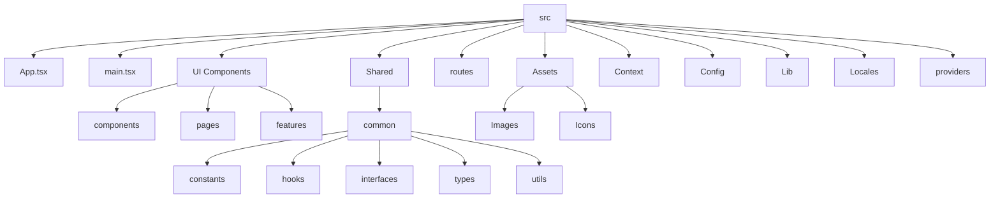

# Trizen

## Stacks and technologies

### Project Structure

The project is organized into the following directories and files:

```mermaid
graph TB
  src
  src --> App[App.tsx]
  src --> main[main.tsx]

  src --> UI[UI Components]
  UI --> components[components]
  UI --> pages[pages]
  UI --> features[features]

  src --> Shared[Shared]
  Shared --> common[common]
  common --> constants[constants]
  common --> hooks[hooks]
  common --> interfaces[interfaces]
  common --> types[types]
  common --> utils[utils]

  src --> routes[routes]


  src --> Assets[Assets]
  Assets --> assets[Images]
  Assets --> styles[Icons]

  src --> context[Context]
  src --> config[Config]
  src --> lib[Lib]
  src --> locales[Locales]

  src --> providers[providers]


```
