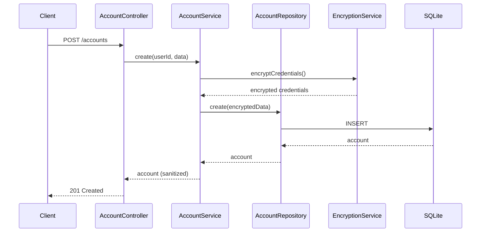
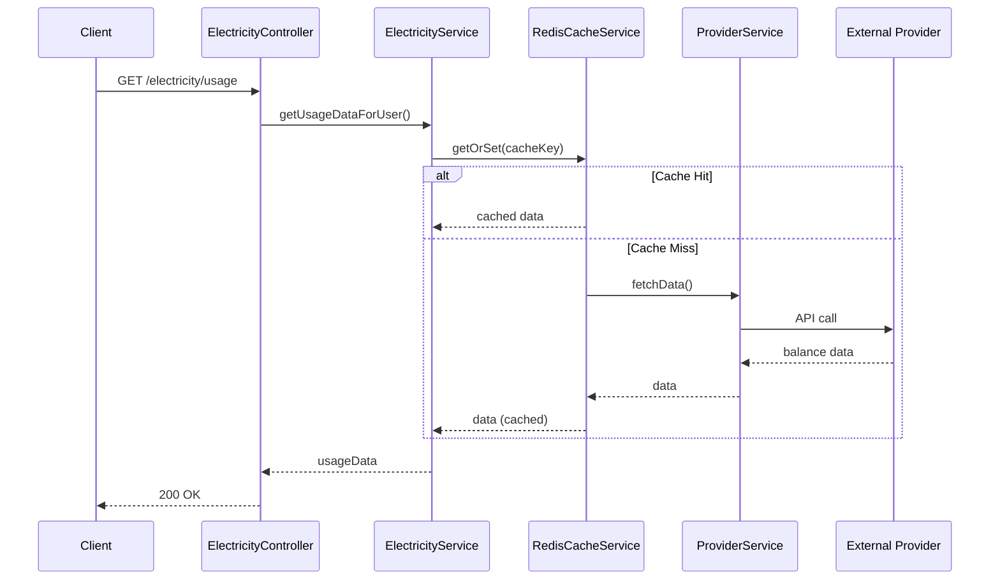

# Architecture Overview

## Project Structure

```text
electricity-bill-viewer/
├── client/                          # React + Vite frontend
│   ├── src/
│   │   ├── common/
│   │   │   ├── apis/               # API client functions (accounts, auth, electricity, telegram, notificationSettings)
│   │   │   ├── constants/          # App-wide constants
│   │   │   ├── hooks/              # Custom React hooks
│   │   │   └── types/              # TypeScript type definitions
│   │   ├── components/
│   │   │   ├── auth/               # GoogleLoginButton, ProtectedRoute, PublicOnlyRoute
│   │   │   ├── layout/             # MainLayout, UserMenu
│   │   │   ├── partials/           # animatedLogo, appLoader, errorBoundary, errorCard, navbar, typography, multiSelect
│   │   │   ├── test/               # Test utilities
│   │   │   └── ui/                 # shadcn/ui components
│   │   ├── context/                # AuthContext, PreferenceContext
│   │   ├── features/
│   │   │   ├── accountBalance/     # Electricity balance display & refresh
│   │   │   ├── accountManagement/  # CRUD UI for DPDC/NESCO accounts
│   │   │   └── home/               # Home page feature
│   │   ├── lib/                    # Axios instance, cache service
│   │   ├── pages/                  # LoginPage, AuthCallbackPage, HomePage, AccountManagementPage, ErrorPage
│   │   ├── providers/              # React context providers
│   │   ├── routes/                 # Route definitions (public, auth, notFound)
│   │   └── styles/                 # Global styles
│   ├── nginx.conf                  # Production Nginx config
│   └── vite.config.ts
├── server/                          # Node.js + Express backend
│   ├── src/
│   │   ├── configs/                # config, constants, cors, database, rateLimiter, redis, winston
│   │   ├── controllers/
│   │   │   ├── BaseController.ts   # Shared response helpers
│   │   │   └── v1/                 # AuthController, AccountController, ElectricityController, TelegramController, NotificationSettingsController
│   │   ├── entities/               # Account, User, TelegramNotificationSettings (TypeORM)
│   │   ├── helpers/                # ApiError, Logger, ResponseBuilder, Winston, fetchHelper
│   │   ├── interfaces/             # Account, Auth, Shared, IZodValidationSchema
│   │   ├── middlewares/            # AuthMiddleware, ValidationMiddleware, LatencyLoggerMiddleware, ApplyGlobalErrorHandler, ApplyGlobalMiddlewares
│   │   ├── repositories/           # AccountRepository, UserRepository, TelegramNotificationSettingsRepository
│   │   ├── routes/v1/             # auth, account, electricity, telegram, notificationSettings routes
│   │   ├── schemas/                # Zod validation schemas (AccountSchemas)
│   │   ├── services/
│   │   │   ├── implementations/    # AccountService, AuthService, DPDCService, NESCOService, ElectricityService, JwtService, RedisCacheService, TelegramService, NotificationSettingsService, SchedulerService
│   │   │   └── interfaces/         # Service interfaces
│   │   └── utility/                # encryption, accountCredentialParser, accountTypeNormalizer, dateFormatter, headers, handleRepositoryCall
│   └── tsconfig.json               # TypeScript config with path aliases
├── docker-compose.yml               # Development compose
├── docker-compose.prod.yml          # Production compose
├── Dockerfile.server                # Multi-stage server build
├── Dockerfile.client                # Multi-stage client build
├── scripts/                         # Utility scripts
└── docs/                            # Documentation
```

## Tech Stack

| Layer         | Technologies                                                                                                                     |
| ------------- | -------------------------------------------------------------------------------------------------------------------------------- |
| **Frontend**  | React 19, Vite, TypeScript, Tailwind CSS 4, shadcn/ui, TanStack Query, Framer Motion, React Hook Form, Zod, Sonner, React Router |
| **Backend**   | Node.js 22, Express, TypeScript, TypeORM, Zod, Axios, Cheerio, Winston                                                           |
| **Databases** | SQLite (dual: `accounts.db` + `auth.db`)                                                                                         |
| **Caching**   | Redis (server-side), localStorage (client-side)                                                                                  |
| **Auth**      | Google OAuth 2.0, JWT (jsonwebtoken)                                                                                             |
| **DevOps**    | Docker, Docker Compose, Coolify, Nginx                                                                                           |

## Dual Database Architecture

The server uses **two separate SQLite databases** to isolate concerns:

| Database         | File          | Entities                                  | Purpose                                                                |
| ---------------- | ------------- | ----------------------------------------- | ---------------------------------------------------------------------- |
| `AppDataSource`  | `accounts.db` | `Account`, `TelegramNotificationSettings` | Application data — encrypted provider credentials, notification config |
| `AuthDataSource` | `auth.db`     | `User`                                    | Authentication data — Google OAuth user profiles                       |

Both databases use TypeORM with `synchronize: true` for automatic schema management.

## Backend Architecture Pattern

The server follows the **Controller → Service → Repository** pattern:

```text
Request → Middleware Pipeline → Controller → Service → Repository → Database
                                                    ↘ External APIs (DPDC/NESCO)
                                                    ↘ Redis Cache
                                                    ↘ Telegram Bot API
```

### Middleware Pipeline

1. **Helmet** — Security headers
2. **CORS** — Configured from `ALLOWED_ORIGINS` / `FRONTEND_URL`
3. **Compression** — Response compression
4. **Body Parser** — JSON parsing
5. **Rate Limiter** — Configurable request rate limiting
6. **Latency Logger** — Optional per-request timing (controlled by `ENABLE_LATENCY_LOGGER`)
7. **Auth Middleware** — JWT verification on protected routes
8. **Validation Middleware** — Zod schema validation on specific routes
9. **Global Error Handler** — Centralized error handling

### Route Organization

Routes are split into **public** and **protected** groups:

| Group                 | Prefix                          | Auth Required | Routes                                 |
| --------------------- | ------------------------------- | :-----------: | -------------------------------------- |
| Auth                  | `/api/v1/auth`                  |  ❌ (mostly)  | Google OAuth flow, `/me` requires auth |
| Electricity           | `/api/v1/electricity`           |      ✅       | Usage data                             |
| Accounts              | `/api/v1/accounts`              |      ✅       | Full CRUD + nicknames                  |
| Telegram              | `/api/v1/telegram`              |      ✅       | Send balances                          |
| Notification Settings | `/api/v1/notification-settings` |      ✅       | Telegram notification config           |

## Frontend Architecture

- **State Management**: AuthContext (React Context) for auth, TanStack Query for server state
- **Routing**: React Router with `ProtectedRoute` and `PublicOnlyRoute` wrappers
- **API Layer**: Centralized Axios instance with JWT interceptor and 401 auto-redirect
- **Features**: Modular feature directories with co-located components, hooks, constants, and utilities

## Request Lifecycle

### Authentication Request Flow

```
1. User clicks "Sign in with Google"
   ↓
2. Client redirects to /api/v1/auth/google
   ↓
3. Server redirects to Google OAuth
   ↓
4. User authenticates with Google
   ↓
5. Google redirects to /api/v1/auth/google/callback
   ↓
6. Server exchanges code for tokens
   ↓
7. Server fetches user profile from Google
   ↓
8. Server finds or creates user in auth.db
   ↓
9. Server generates JWT token
   ↓
10. Server redirects to /auth/callback?token=<jwt>
   ↓
11. Client stores token in localStorage
   ↓
12. Client redirects to home page
```

### Balance Fetch Request Flow

```
1. Client requests GET /api/v1/electricity/usage
   ↓
2. AuthMiddleware validates JWT
   ↓
3. ElectricityController extracts userId
   ↓
4. ElectricityService fetches credentials from DB
   ↓
5. Credentials decrypted via EncryptionService
   ↓
6. Check Redis cache for existing data
   ↓
7a. [Cache Hit] Return cached data
7b. [Cache Miss] Continue to step 8
   ↓
8. DPDCService/NESCOService fetches from provider
   ↓
9. Data transformed and cached in Redis
   ↓
10. Response returned to client
```

## Data Flow

### Account Creation



### Balance Retrieval



## Design Patterns Used

### Repository Pattern

Data access is abstracted behind repository interfaces:

```typescript
// Repository handles all database operations
class AccountRepository {
  async findById(id: string): Promise<Account | null>;
  async findByUserId(userId: string): Promise<Account[]>;
  async create(data: CreateAccountDto): Promise<Account>;
  async update(id: string, data: UpdateAccountDto): Promise<Account>;
  async delete(id: string): Promise<void>;
}
```

### Service Layer Pattern

Business logic is encapsulated in service classes:

```typescript
// Service orchestrates operations
class ElectricityService {
  async getUsageDataForUser(
    userId: string,
    skipCache?: boolean,
  ): Promise<UsageResponse>;
  // Coordinates: credentials retrieval, caching, provider calls, data transformation
}
```

### Strategy Pattern

Provider services implement a common interface:

```typescript
interface IProviderService {
    getProviderName(): ElectricityProvider;
    getAccountInfo(username: string, password?: string, clientSecret?: string): Promise<ProviderAccountResult>;
}

// Implementations
class DPDCService implements IProviderService { ... }
class NESCOService implements IProviderService { ... }
```

### Singleton Pattern

Configuration and logging use singletons:

```typescript
// Configuration loaded once
export const appConfig = { ... };

// Logger instance shared
const logger = createLogger({ ... });
export default logger;
```

## Security Architecture

### Authentication Layer

```
           ┌──────────────────┐
           │  Google OAuth    │
           │  (External)      │
           └────────┬─────────┘
                    │ User Profile
                    ▼
           ┌──────────────────┐
           │  AuthService     │
           │  - findOrCreate  │
           │  - generateJWT   │
           └────────┬─────────┘
                    │ JWT Token
                    ▼
           ┌──────────────────┐
           │  AuthMiddleware  │
           │  - verify JWT    │
           │  - attach user   │
           └────────┬─────────┘
                    │ AuthenticatedRequest
                    ▼
           ┌──────────────────┐
           │  Controllers     │
           │  (Protected)     │
           └──────────────────┘
```

### Data Protection Layer

```
        User Input                  Database
            │                           ▲
            ▼                           │
    ┌───────────────┐           ┌───────────────┐
    │ Zod Validation │           │ TypeORM       │
    │ (Input)        │           │ (ORM)         │
    └───────┬───────┘           └───────┬───────┘
            │                           │
            ▼                           │
    ┌───────────────┐           ┌───────────────┐
    │ Service       │ ────────▶ │ Encryption    │
    │ Layer         │           │ Service       │
    └───────────────┘           └───────────────┘
```

## Scalability Considerations

### Current Architecture (Monolith)

- Single Express server
- SQLite databases (file-based)
- Redis for caching
- Suitable for: Personal use, small deployments

### Future Scaling Options

1. **Horizontal Scaling**
   - Move from SQLite to PostgreSQL
   - Stateless JWT enables multiple server instances
   - Redis already supports clustering

2. **Microservices Split**
   - Auth Service
   - Account Service
   - Provider Service (DPDC, NESCO)
   - Notification Service

3. **Event-Driven Architecture**
   - Use message queues for background tasks
   - Separate scheduler into worker process

See the main README for quick start and `docs/` for details on each topic.
